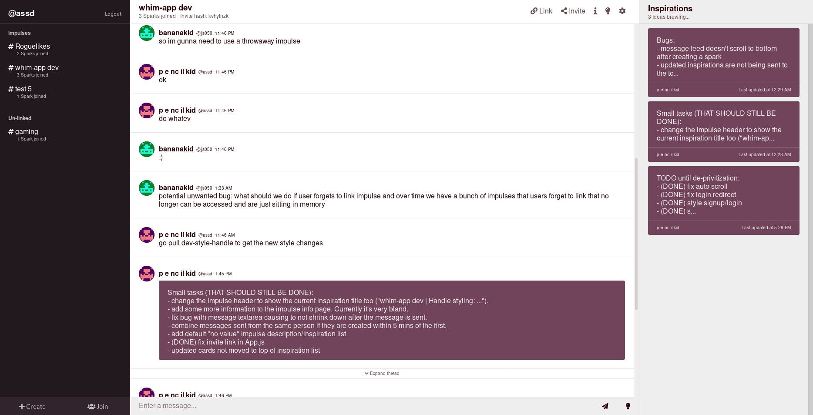

# whim

A text channel based chat application for collaboration and brainstorming.

## Features

* Create impulses -- these are text channels that anyone can create. Share the link to let others join!
* Skip creating an account -- No signup required. Simply create or join an impulse to start chatting.
* Anonymous sparks -- these are anonymous identities that represent you in each impulse. If you wish to
persist an impulse beyond the current browser session, create an account and link the spark to it.
* Post inspirations -- create a note that encapsulates an idea, problem, task, or anything really. Each one spawns
a thread of it's own and can be revised, so everyone in the impulse can contribute to the idea.

### Inspiration/Goals

I began work on this project to practice creating a webapp from scratch -- taking
an idea from conception to reality. For the last few months, I've been learning Rails
as a backend framework and wanted to dabble in frontend development as well. And so I
chose to pick up react and learn how to make the two click.

As for what to make, I thought it'd be cool to recreate an instant messaging app, much like
Slack, Discord, or Messenger, since these are tools I commonly use to organize groups
for projects, etc. However, it's a hassle when not everyone uses the same platform -- some
people have accounts for one while others don't. And so I wanted to make something that didn't
require signup, letting everyone join instantly. Following the collaborative theme, I added the ability to create
"inspirations". I often scribble down my thoughts on sticky, usually for ideas, tasks, or reminders.
And so I thought it'd be useful to have a disposable, virtual note that everyone can see.
Inspirations thus serve as a "shared" post-it note: something that anyone can share their ideas through, no matter how 
simple or complex.

## How to use

Start by creating an impulse.

Then, create a spark. Give yourself a unique name that others see you as.

Start chatting!

Create inspirations by clicking the inspiration button when submitting a message.

New inspirations show up here

Click on one to enlarge it

Notice that the thread changed. Messages sent now are under this inspiration's thread.

## Built With

* React/Redux - frontend framework
* Rails - backend framework
* Heroku - hosting
* Vanilla CSS

## Running locally

### Setting up frontend

0. Install nodejs/npm
1. Clone this repo
2. Run npm i inside the repo to install module dependancies
3. Modify package.json to run the server on the desired port
4. Update API_ROOT and API_WS_ROOT in src/constants/index.js to match your backend server enpoint

### Setting up backend

0. Install ruby, Rails, and postgreSQL
1. Clone the backend API repo [here](https://github.com/XianhaiC/whim-backend)
2. Fill out config/application.yml with details for postgreSQL and ActionMailer
3. Inside the repo, run bundle install

## TODO list

* Switch to using cookies for authentication. JWT tokens are currently being store in localStorage
* Message deletion
* Impulse deletion
* Mobile support (responsive CSS)

## Contributing

If you there's any bugs, security flaws, or suggestions, let me know! Submit a PR
request if you wish as well. I'm always looking to improve this project.

## Authors

* [Xianhai Cao](https://github.com/XianhaiC)
* [Justin Sung](https://github.com/jsungg)
